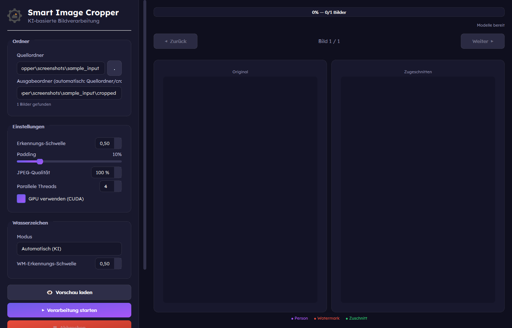

<p align="center">
  
</p>

# Smart Image Cropper

**AI-powered batch image cropping with person detection and watermark removal.**

A Windows desktop application built with Python and PyQt6 that automatically detects persons in images using YOLOv8 and intelligently crops around them — with optional watermark detection and removal. Process hundreds of images in batch with a live preview.

---

## Features

- **AI Person Detection** — YOLOv8-based detection (COCO class 0) with configurable confidence threshold
- **Intelligent Cropping** — Automatic crop region calculation with adjustable padding
- **Watermark Handling** — Manual mode (fixed bottom-percentage crop) or auto mode (YOLO-based watermark detection)
- **Batch Processing** — Process entire directories of images (JPEG, PNG, BMP, WebP)
- **Live Preview** — Real-time visualization of detection and crop results during processing
- **GPU Acceleration** — CUDA support with automatic CPU fallback
- **Modern UI** — Glassmorphism-styled PyQt6 interface (German language)
- **Fully Offline** — No cloud, no uploads, runs 100% locally
- **Portable** — Standalone Windows EXE (no installation required)

## Screenshot

<p align="center">
  
</p>

## Quick Start

### Prerequisites

- Python 3.11+
- Windows 10/11

### Installation

```bash
# Clone the repository
git clone https://github.com/BassBoost1981/SmartImageCropper.git
cd SmartImageCropper

# Create virtual environment
python -m venv .venv
.venv\Scripts\activate

# Install dependencies
pip install -r requirements.txt
```

### Run

```bash
python main.py
```

### Build Standalone EXE

```bash
# Install build dependencies
pip install -r requirements-dev.txt

# Generate icon (first time only)
python build/generate_icon.py

# Build EXE
build_exe.bat
```

## Project Structure

```
main.py                  # Application entry point
src/
  ui/                    # PyQt6 UI layer
    main_window.py       # Main application window
    preview_widget.py    # Image preview component
    selection_dialog.py  # File/folder selection
    widgets.py           # Reusable UI components
    styles.py            # Glassmorphism stylesheet
  core/                  # AI detection & crop pipeline
    detector.py          # YOLOv8 person detection
    watermark.py         # Watermark detection (auto mode)
    cropper.py           # Crop region calculation & execution
    processor.py         # Batch processing orchestration
  utils/                 # Configuration, logging, helpers
    config.py            # Settings management
    logger.py            # Rotating file logger
    file_manager.py      # File scanning & I/O
    stats.py             # Processing statistics
models/                  # YOLO model weights (.pt)
config/                  # Runtime settings (settings.json)
build/                   # PyInstaller spec & NSIS installer
tests/                   # Pytest test suite
```

## Configuration

Settings are stored in `config/settings.json` and can be adjusted via the UI:

| Setting | Default | Description |
|---------|---------|-------------|
| `jpeg_quality` | 95 | JPEG output quality |
| `confidence_threshold` | 0.5 | YOLO detection confidence |
| `padding_percent` | 10 | Padding around detected person (%) |
| `watermark_mode` | manual | `manual` or `auto` |
| `watermark_percent` | 0 | Manual watermark crop from bottom (%) |
| `use_gpu` | true | Use CUDA if available |
| `max_workers` | 4 | Parallel processing threads |
| `output_format` | original | Keep original format or convert |

## AI Models

| Model | Size | Purpose |
|-------|------|---------|
| `yolov8n.pt` | ~6.5 MB | Person detection |
| `best.pt` | ~109 MB | Watermark detection (auto mode, downloaded on demand from HuggingFace) |

## Development

```bash
# Install dev dependencies
pip install -r requirements-dev.txt

# Run tests
pytest tests/ -v

# Format code
black src/ tests/

# Lint
flake8 src/ tests/

# Type check
mypy src/
```

## License

MIT

---

<p align="center">
  
</p>

# Smart Image Cropper (Deutsch)

**KI-gestütztes Batch-Bildcropping mit Personenerkennung und Wasserzeichen-Entfernung.**

Eine Windows-Desktop-Anwendung, entwickelt mit Python und PyQt6, die automatisch Personen in Bildern mittels YOLOv8 erkennt und intelligent um sie herum zuschneidet — mit optionaler Wasserzeichen-Erkennung und -Entfernung. Verarbeitet hunderte Bilder im Batch mit Live-Vorschau.

---

## Bildschirmfoto

<p align="center">
  
</p>

## Funktionen

- **KI-Personenerkennung** — YOLOv8-basierte Erkennung (COCO Klasse 0) mit einstellbarer Konfidenzschwelle
- **Intelligentes Cropping** — Automatische Berechnung des Zuschnittsbereichs mit konfigurierbarem Padding
- **Wasserzeichen-Behandlung** — Manueller Modus (fester Prozent-Zuschnitt von unten) oder Auto-Modus (YOLO-basierte Wasserzeichen-Erkennung)
- **Batch-Verarbeitung** — Verarbeitung ganzer Verzeichnisse (JPEG, PNG, BMP, WebP)
- **Live-Vorschau** — Echtzeit-Visualisierung der Erkennungs- und Zuschnittsergebnisse
- **GPU-Beschleunigung** — CUDA-Unterstützung mit automatischem CPU-Fallback
- **Moderne Oberfläche** — Glassmorphism-gestylte PyQt6-Oberfläche (deutsche Sprache)
- **Vollständig offline** — Keine Cloud, keine Uploads, läuft 100% lokal
- **Portabel** — Eigenständige Windows-EXE (keine Installation nötig)

## Schnellstart

### Voraussetzungen

- Python 3.11+
- Windows 10/11

### Installation

```bash
# Repository klonen
git clone https://github.com/BassBoost1981/SmartImageCropper.git
cd SmartImageCropper

# Virtuelle Umgebung erstellen
python -m venv .venv
.venv\Scripts\activate

# Abhängigkeiten installieren
pip install -r requirements.txt
```

### Starten

```bash
python main.py
```

### Eigenständige EXE erstellen

```bash
# Build-Abhängigkeiten installieren
pip install -r requirements-dev.txt

# Icon generieren (nur beim ersten Mal)
python build/generate_icon.py

# EXE bauen
build_exe.bat
```

## Konfiguration

Einstellungen werden in `config/settings.json` gespeichert und können über die Benutzeroberfläche angepasst werden:

| Einstellung | Standard | Beschreibung |
|-------------|----------|--------------|
| `jpeg_quality` | 95 | JPEG-Ausgabequalität |
| `confidence_threshold` | 0.5 | YOLO-Erkennungskonfidenz |
| `padding_percent` | 10 | Abstand um erkannte Person (%) |
| `watermark_mode` | manual | `manual` oder `auto` |
| `watermark_percent` | 0 | Manueller Wasserzeichen-Zuschnitt von unten (%) |
| `use_gpu` | true | CUDA verwenden falls verfügbar |
| `max_workers` | 4 | Parallele Verarbeitungs-Threads |
| `output_format` | original | Originalformat beibehalten oder konvertieren |

## KI-Modelle

| Modell | Größe | Zweck |
|--------|-------|-------|
| `yolov8n.pt` | ~6,5 MB | Personenerkennung |
| `best.pt` | ~109 MB | Wasserzeichen-Erkennung (Auto-Modus, wird bei Bedarf von HuggingFace heruntergeladen) |

## Entwicklung

```bash
# Dev-Abhängigkeiten installieren
pip install -r requirements-dev.txt

# Tests ausführen
pytest tests/ -v

# Code formatieren
black src/ tests/

# Linting
flake8 src/ tests/

# Typprüfung
mypy src/
```

## Lizenz

MIT
