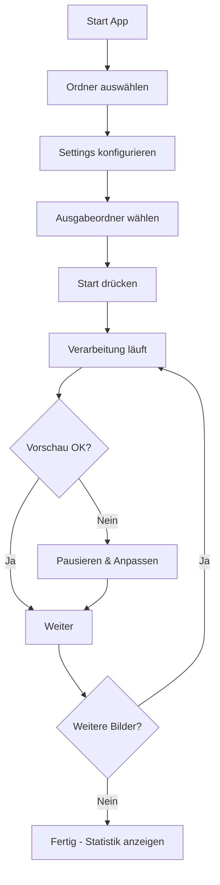

# Product Requirements Document (PRD)

## Smart Image Cropper - Automatisches Bildverarbeitungstool

**Version:** 1.0  
**Datum:** 14. Februar 2026  
**Status:** Draft  
**Autor:** Produktentwicklung

---

## 1. Executive Summary

### 1.1 Überblick
Smart Image Cropper ist eine Desktop-Anwendung für die automatisierte Batch-Verarbeitung von Bildern mit Personenerkennung. Das Tool schneidet Bilder intelligent auf Personen zu und entfernt gleichzeitig Watermarks, wobei der gesamte Prozess in Echtzeit visualisiert wird.

### 1.2 Kernfunktionalität
- **Automatische Personenerkennung** mittels KI (YOLO)
- **Intelligentes Cropping** mit konfigurierbarem Padding
- **Watermark-Entfernung** durch Zonen-basiertes Cropping
- **Live-Visualisierung** des Verarbeitungsprozesses
- **Batch-Verarbeitung** für hunderte Bilder
- **Vollständig offline** und portabel (keine Installation erforderlich)

### 1.3 Zielgruppe
- Fotografen mit großen Bildbeständen
- Content Creators
- E-Commerce-Anbieter (Produktfotos)
- Social Media Manager
- Agenturen mit Bildbearbeitungsbedarf

---

## 2. Problemstellung

### 2.1 Aktueller Pain Point
Nutzer müssen große Mengen an Bildern manuell zuschneiden, wobei:
- **Zeitaufwand:** Manuelles Cropping pro Bild: 30-60 Sekunden
- **Inkonsistenz:** Unterschiedliche Crop-Qualität bei manueller Arbeit
- **Watermarks:** Müssen separat entfernt werden
- **Keine Kontrolle:** Batch-Tools ohne Vorschau = kein Quality Control
- **Cloud-Abhängigkeit:** Bestehende Tools erfordern Upload sensibler Daten

### 2.2 Warum bestehende Lösungen nicht ausreichen
| Lösung | Problem |
|--------|---------|
| Photoshop Batch | Keine KI-basierte Personenerkennung, komplex |
| Online-Tools | Datenschutz, Upload-Zeit, Kosten |
| Einfache Batch-Cropper | Kein intelligentes Cropping, keine Vorschau |
| KI-Tools (Cloud) | Teuer, Datenschutz, keine Offline-Nutzung |

---

## 3. Ziele & Nicht-Ziele

### 3.1 Ziele (In Scope)

**Phase 1 - MVP:**
- ✅ Automatische Personenerkennung mit YOLO v8
- ✅ Batch-Verarbeitung (unbegrenzte Bildanzahl)
- ✅ Live-Vorschau während Verarbeitung
- ✅ Watermark-Entfernung (zonenbasiert)
- ✅ Moderne, intuitive UI
- ✅ Portable EXE (keine Installation)
- ✅ GPU-Beschleunigung (CUDA)

**Phase 2 - Erweitert:**
- ⏳ Manuelle Korrektur-Möglichkeit (Review-Modus)
- ⏳ Batch-Einstellungen (unterschiedliche Configs)
- ⏳ Export-Formate (JPEG, PNG, WebP)
- ⏳ Metadaten-Erhaltung (EXIF)

**Phase 3 - Advanced:**
- 🔮 Multi-Person Handling
- 🔮 AI-basiertes Watermark Inpainting
- 🔮 Cloud-Sync optional
- 🔮 Plugins/Extensions System

### 3.2 Nicht-Ziele (Out of Scope)

❌ Video-Verarbeitung  
❌ RAW-Format Support (initial)  
❌ Erweiterte Bildbearbeitung (Filter, Effekte)  
❌ Cloud-Storage Integration  
❌ Multi-User / Team-Features  
❌ Mobile App  
❌ macOS/Linux Support (initial - nur Windows)

---

## 4. User Stories & Use Cases

### 4.1 Primary User Stories

**US-001: Batch-Verarbeitung**
```
Als Fotograf
möchte ich 500 Event-Fotos automatisch auf Personen zuschneiden
damit ich Zeit spare und konsistente Ergebnisse habe
```
**Akzeptanzkriterien:**
- Ordner-Auswahl möglich
- Verarbeitung läuft ohne Unterbrechung
- Fortschritt wird angezeigt
- Fehlerhafte Bilder werden übersprungen

**US-002: Live-Kontrolle**
```
Als E-Commerce Manager
möchte ich während der Verarbeitung sehen, wie Bilder zugeschnitten werden
damit ich Qualitätsprobleme sofort erkenne
```
**Akzeptanzkriterien:**
- Echtzeit-Vorschau jedes Bildes
- Vorher/Nachher Vergleich sichtbar
- Erkennungs-Boxen visualisiert
- Pausieren bei Problemen möglich

**US-003: Watermark-Entfernung**
```
Als Content Creator
möchte ich Stock-Fotos von Watermarks befreien
damit ich sie für Social Media nutzen kann
```
**Akzeptanzkriterien:**
- Konfigurierbare Watermark-Zone (%)
- Vorschau der Crop-Grenzen
- Watermark-Bereich wird aus Output entfernt

**US-004: Portable Nutzung**
```
Als Freelancer
möchte ich das Tool von USB-Stick starten
damit ich es an verschiedenen Arbeitsplätzen nutzen kann
```
**Akzeptanzkriterien:**
- Keine Installation erforderlich
- Alle Dependencies im Programmordner
- Settings werden lokal gespeichert
- Läuft ohne Admin-Rechte

### 4.2 Use Case Flows

**UC-001: Standard Batch Processing**



---

## 5. Funktionale Anforderungen

### 5.1 Bildverarbeitung

| ID | Anforderung | Priorität | Details |
|----|-------------|-----------|---------|
| **FR-001** | YOLO-basierte Personenerkennung | P0 | YOLOv8n für Geschwindigkeit, Confidence Threshold: 0.5 |
| **FR-002** | Multi-Person Handling | P1 | Größte Person auswählen als Haupt-Subjekt |
| **FR-003** | Automatisches Cropping | P0 | Bounding Box + konfigurierbares Padding |
| **FR-004** | Watermark-Zonen Cropping | P0 | Prozentuale Zone (default: untere 15%) |
| **FR-005** | Batch-Verarbeitung | P0 | Unbegrenzte Anzahl, Multi-Threading |
| **FR-006** | Format-Support | P0 | JPEG, PNG, BMP, WebP (Input) |
| **FR-007** | Qualitäts-Einstellungen | P1 | JPEG Quality 70-100% |
| **FR-008** | Fehlerbehandlung | P0 | Skip bei Fehler, Log erstellen |

### 5.2 UI/UX Features

| ID | Feature | Priorität | Beschreibung |
|----|---------|-----------|--------------|
| **FR-101** | Split-View Vorschau | P0 | Interaktiver Slider für Vorher/Nachher |
| **FR-102** | Thumbnail-Galerie | P1 | Scrollbare Grid-Ansicht aller Bilder |
| **FR-103** | Detection Overlay | P1 | Zeigt Erkennungs-Boxen auf Original |
| **FR-104** | Fortschrittsanzeige | P0 | Prozent, ETA, Geschwindigkeit |
| **FR-105** | Statistik-Dashboard | P1 | Anzahl, Erfolgsrate, Zeitersparnis |
| **FR-106** | Ansichts-Modi | P1 | Side-by-Side, Split, Overlay, Grid |
| **FR-107** | Pause/Resume | P2 | Verarbeitung anhalten/fortsetzen |
| **FR-108** | Review-Modus | P2 | Manuelle Überprüfung jedes Bildes |

### 5.3 Konfiguration & Settings

| ID | Setting | Typ | Default | Range |
|----|---------|-----|---------|-------|
| **FR-201** | Watermark Prozent | Slider | 15% | 0-30% |
| **FR-202** | Padding | Spinbox | 50px | 0-200px |
| **FR-203** | JPEG Qualität | Spinbox | 95% | 70-100% |
| **FR-204** | Preview Delay | Spinbox | 200ms | 0-2000ms |
| **FR-205** | GPU Verwendung | Checkbox | true | - |
| **FR-206** | Confidence Threshold | Slider | 0.5 | 0.1-0.9 |
| **FR-207** | Multi-Person Modus | Dropdown | Größte | Größte/Alle/Erste |

### 5.4 Datei-Management

| ID | Anforderung | Details |
|----|-------------|---------|
| **FR-301** | Ordner-Input | Rekursive Suche optional |
| **FR-302** | Multi-File Selection | Mehrfachauswahl im Dialog |
| **FR-303** | Output-Ordner | Custom oder gleicher Ordner + Suffix |
| **FR-304** | Namenskonvention | Original-Name oder Custom Pattern |
| **FR-305** | Duplikat-Handling | Überschreiben/Skip/Umbenennen |
| **FR-306** | Error-Log | CSV-Export mit Fehler-Details |

---

## 6. Technische Anforderungen

### 6.1 Technologie-Stack

**Backend/Core:**
```yaml
Sprache: Python 3.11+
KI-Framework: 
  - ultralytics (YOLOv8)
  - PyTorch 2.2+
  - CUDA 12.1+ (optional)
Bildverarbeitung:
  - OpenCV 4.9+
  - Pillow 10.2+
  - NumPy 1.26+
```

**Frontend/UI:**
```yaml
Framework: PyQt6 6.6+
Styling: Custom QSS (Glassmorphism)
Icons: Unicode Emojis + Custom SVG
```

**Build & Distribution:**
```yaml
Bundler: PyInstaller 6.0+
Kompression: UPX
Target: Windows 10/11 (64-bit)
Installer: Optional NSIS
```

### 6.2 System-Anforderungen

**Minimum:**
- OS: Windows 10 64-bit
- RAM: 8 GB
- CPU: Intel i5 (8th Gen) oder AMD Ryzen 5
- GPU: Nicht erforderlich (CPU-Fallback)
- Festplatte: 2 GB frei

**Empfohlen:**
- OS: Windows 11 64-bit
- RAM: 16 GB
- CPU: Intel i7 (10th Gen+) oder AMD Ryzen 7
- GPU: NVIDIA RTX 2060+ (6GB VRAM)
- Festplatte: 5 GB frei (SSD)

**Performance-Ziele:**
- Verarbeitung: 3-5 Bilder/Sekunde (GPU)
- Verarbeitung: 1-2 Bilder/Sekunde (CPU)
- UI-Responsiveness: < 100ms für Updates
- Startup-Zeit: < 5 Sekunden
- RAM-Nutzung: < 4 GB bei 1000 Bildern

### 6.3 Architektur

```
┌─────────────────────────────────────────┐
│           UI Layer (PyQt6)              │
│  MainWindow │ PreviewWidget │ Gallery   │
└────────────┬────────────────────────────┘
             │
┌────────────▼────────────────────────────┐
│        Business Logic Layer             │
│  ImageProcessor │ SettingsManager       │
│  QueueManager   │ StatsCollector        │
└────────────┬────────────────────────────┘
             │
┌────────────▼────────────────────────────┐
│         AI/CV Layer                     │
│  YOLODetector │ CropEngine              │
│  WatermarkRemover                       │
└────────────┬────────────────────────────┘
             │
┌────────────▼────────────────────────────┐
│        Data Layer                       │
│  FileManager │ ImageIO │ ConfigIO       │
└─────────────────────────────────────────┘
```

### 6.4 Projekt-Struktur

```
SmartImageCropper/
├── src/
│   ├── main.py                 # Entry Point
│   ├── ui/
│   │   ├── main_window.py      # Hauptfenster
│   │   ├── preview_widget.py   # Preview-Komponenten
│   │   ├── gallery_widget.py   # Thumbnail-Galerie
│   │   ├── stats_widget.py     # Statistik-Dashboard
│   │   └── styles.py           # QSS Styling
│   ├── core/
│   │   ├── processor.py        # ImageProcessor Thread
│   │   ├── detector.py         # YOLO Wrapper
│   │   ├── cropper.py          # Crop-Engine
│   │   └── watermark.py        # Watermark-Removal
│   ├── utils/
│   │   ├── file_manager.py     # Datei-Handling
│   │   ├── config.py           # Settings Management
│   │   ├── logger.py           # Logging
│   │   └── stats.py            # Statistik-Collector
│   └── resources/
│       ├── icons/              # Icons & Assets
│       └── styles/             # QSS Files
├── models/
│   └── yolov8n.pt              # YOLO Model
├── config/
│   └── settings.json           # User Settings
├── tests/
│   ├── test_detector.py
│   ├── test_cropper.py
│   └── test_ui.py
├── build/
│   ├── build.spec              # PyInstaller Spec
│   └── icon.ico                # App Icon
├── requirements.txt
├── requirements-dev.txt
├── README.md
└── LICENSE
```

### 6.5 Abhängigkeiten (requirements.txt)

```txt
# UI Framework
PyQt6==6.6.1
PyQt6-Qt6==6.6.1

# AI/ML
ultralytics==8.1.24
torch==2.2.0+cu121
torchvision==0.17.0+cu121

# Bildverarbeitung
opencv-python==4.9.0.80
Pillow==10.2.0
numpy==1.26.3

# Utilities
pyyaml==6.0.1
tqdm==4.66.1

# Build
pyinstaller==6.3.0
```

---

## 7. UI/UX Requirements

### 7.1 Design-Prinzipien

1. **Glassmorphism Modern UI**
   - Transparente Panels mit Blur-Effekt
   - Gradient-Buttons
   - Weiche Schatten & Rundungen
   - Dark Theme (Hauptfarben: #0f0f1e, #1a1a2e)

2. **Responsive Layout**
   - Minimum: 1200x800px
   - Skaliert auf 4K-Displays
   - Panels kollabierbar

3. **Feedback & Affordance**
   - Hover-Effekte auf allen Buttons
   - Loading-Indikatoren bei langen Operationen
   - Erfolgs-/Fehler-Toast-Notifications
   - Tooltips auf allen Controls

### 7.2 Farbschema

```css
Primary Colors:
  Background Gradient: #0f0f1e → #1a1a2e
  Panel Background: rgba(255, 255, 255, 0.05)
  Panel Border: rgba(255, 255, 255, 0.1)

Accent Colors:
  Primary Gradient: #667eea → #764ba2
  Success: #10b981
  Warning: #f59e0b
  Error: #ef4444
  
Text Colors:
  Primary: #ffffff
  Secondary: #94a3b8
  Disabled: #475569
```

### 7.3 Typografie

```css
Font Family: Segoe UI, Arial, sans-serif
  
Header: 32px, Bold
Section Title: 18px, Bold
Body: 14px, Regular
Caption: 12px, Regular
Button: 14px, Semi-Bold
```

### 7.4 Layout-Spezifikation

**Hauptfenster (1200x800):**

```
┌──────────────────────────────────────────────────────┐
│  [HEADER: Smart Image Cropper]                       │ 80px
├─────────────┬────────────────────────────────────────┤
│             │  ┌────────────────────────────────┐    │
│   SIDEBAR   │  │   PREVIEW AREA                 │    │
│   400px     │  │   (Split-View / Gallery)       │    │ 500px
│             │  │                                │    │
│   Settings  │  └────────────────────────────────┘    │
│   Input     ├────────────────────────────────────────┤
│   Stats     │  [PROGRESS BAR]                        │ 60px
│             │  Current: image.jpg | ETA: 2:30        │
│   [START]   │  [PAUSE] [RESUME] [CANCEL]             │
└─────────────┴────────────────────────────────────────┘
                                                  ^
                                           Status Bar: 40px
```

### 7.5 Interaktions-Design

**Animation-Timing:**
- Button Hover: 150ms ease-out
- Panel Expand: 300ms ease-in-out
- Image Fade: 200ms
- Progress Update: 100ms

**Keyboard Shortcuts:**
```
Ctrl+O   - Ordner öffnen
Ctrl+I   - Bilder auswählen
Ctrl+S   - Settings speichern
Space    - Start/Pause Toggle
Esc      - Abbrechen
F11      - Fullscreen Preview
Ctrl+,   - Settings Dialog
```

---

## 8. Nicht-funktionale Anforderungen

### 8.1 Performance

| Metrik | Ziel | Messung |
|--------|------|---------|
| **Startup-Zeit** | < 5s | Von EXE-Start bis UI bereit |
| **Bildverarbeitung (GPU)** | 3-5 Bilder/s | 1920x1080 JPEG |
| **Bildverarbeitung (CPU)** | 1-2 Bilder/s | 1920x1080 JPEG |
| **UI-Responsiveness** | < 100ms | Button-Click bis Feedback |
| **Preview-Update** | < 50ms | Neue Vorschau anzeigen |
| **RAM-Nutzung** | < 4GB | Bei 1000 Bildern Queue |
| **VRAM-Nutzung** | < 2GB | YOLO Model loaded |

### 8.2 Skalierbarkeit

- **Batch-Größe:** Unbegrenzt (Queue-basiert)
- **Bild-Größe:** Bis 8K (7680x4320)
- **Gleichzeitige Threads:** 4 (konfigurierbar)
- **Model-Cache:** 3 verschiedene YOLO-Modelle

### 8.3 Zuverlässigkeit

- **Fehlertoleranz:** Skip fehlerhafter Bilder, Log-Eintrag
- **Crash-Recovery:** Auto-Save von Progress alle 10 Bilder
- **Validierung:** Input-Checks vor Verarbeitung
- **Graceful Degradation:** CPU-Fallback wenn keine GPU

### 8.4 Usability

- **Lernkurve:** < 5 Minuten für Basis-Funktionen
- **Onboarding:** Tooltip-Hints beim ersten Start
- **Fehler-Messages:** Klar, actionable, in Deutsch
- **Help-System:** Integrierte F1-Hilfe

### 8.5 Wartbarkeit

- **Code-Struktur:** Modular, SOLID-Prinzipien
- **Documentation:** Docstrings für alle Public Methods
- **Logging:** Debug/Info/Warning/Error Levels
- **Unit Tests:** > 70% Code Coverage
- **Version Control:** Git mit Semantic Versioning

### 8.6 Sicherheit & Datenschutz

- **Offline-First:** Keine Internet-Verbindung erforderlich
- **Lokale Verarbeitung:** Alle Daten bleiben auf PC
- **Keine Telemetrie:** Kein Analytics/Tracking
- **EXIF-Handling:** Optional EXIF-Daten beibehalten/entfernen

---

## 9. Entwicklungs-Roadmap

### Phase 1: MVP (4-6 Wochen)

**Sprint 1-2: Core Engine (2 Wochen)**
- [ ] Projekt-Setup & Struktur
- [ ] YOLO Integration & Testing
- [ ] Basic Crop-Engine
- [ ] File Management System
- [ ] Settings Manager

**Sprint 3-4: UI Grundgerüst (2 Wochen)**
- [ ] PyQt6 Main Window
- [ ] Settings Panel
- [ ] File Input UI
- [ ] Basic Progress Bar
- [ ] Styling (Phase 1)

**Sprint 5-6: Integration & Polish (2 Wochen)**
- [ ] ImageProcessor Thread
- [ ] Live Preview (Side-by-Side)
- [ ] Batch Processing
- [ ] Error Handling
- [ ] MVP Testing

**Deliverable Phase 1:**
- ✅ Funktionsfähige EXE
- ✅ Basic UI
- ✅ Batch-Verarbeitung
- ✅ Live-Vorschau

---

### Phase 2: Enhanced Features (3-4 Wochen)

**Sprint 7-8: Advanced UI (2 Wochen)**
- [ ] Split-View Slider
- [ ] Thumbnail-Galerie
- [ ] Statistik-Dashboard
- [ ] Multiple View-Modes
- [ ] Animation & Transitions

**Sprint 9-10: Advanced Processing (2 Wochen)**
- [ ] Review-Modus
- [ ] Pause/Resume
- [ ] Batch-Configs
- [ ] Export-Formate
- [ ] EXIF-Handling

**Deliverable Phase 2:**
- ✅ Professionelle UI
- ✅ Review-Workflows
- ✅ Erweiterte Konfiguration

---

### Phase 3: Optimization & Polish (2-3 Wochen)

**Sprint 11: Performance**
- [ ] Multi-Threading Optimierung
- [ ] Memory Management
- [ ] GPU-Acceleration Tuning
- [ ] Large Batch Testing (10k+ Bilder)

**Sprint 12: UX Polish**
- [ ] Keyboard Shortcuts
- [ ] Drag & Drop
- [ ] Context Menus
- [ ] Tooltips & Help
- [ ] Onboarding Tutorial

**Sprint 13: Documentation & Release**
- [ ] User Manual (PDF)
- [ ] Video Tutorials
- [ ] Installer Creation
- [ ] Release Testing
- [ ] v1.0 Release

**Deliverable Phase 3:**
- ✅ Production-Ready App
- ✅ Complete Documentation
- ✅ Installer Package

---

## 10. Erfolgsmetriken

### 10.1 Qualitative Metriken

| Metrik | Ziel | Messmethode |
|--------|------|-------------|
| **User Satisfaction** | > 4.5/5 | Beta-Tester Feedback |
| **Task Completion Rate** | > 95% | Erfolgreiche Batch-Runs |
| **Ease of Use** | > 4/5 | User Testing |
| **Error Rate** | < 2% | Failed Images / Total |

### 10.2 Quantitative Metriken

| Metrik | Baseline | Ziel | Messung |
|--------|----------|------|---------|
| **Time Savings** | 45s/Bild | 0.3s/Bild | Manuelle vs. Auto |
| **Processing Speed** | N/A | 3-5 Bilder/s | GPU Performance |
| **Accuracy** | N/A | > 92% | Correct Crops |
| **Startup Time** | N/A | < 5s | Launch to Ready |

### 10.3 Business Metriken

- **Downloads:** Ziel 500+ in ersten 3 Monaten
- **Active Users:** Ziel 200+ Monthly Active
- **Retention:** > 60% nach 30 Tagen
- **Support Tickets:** < 5% User Base

---

## 11. Risiken & Mitigation

### 11.1 Technische Risiken

| Risiko | Wahrscheinlichkeit | Impact | Mitigation |
|--------|-------------------|--------|------------|
| **YOLO zu langsam auf CPU** | Mittel | Hoch | CPU-optimierte Models (ONNX), Quantization |
| **PyInstaller Bundle zu groß** | Hoch | Mittel | UPX Compression, Dependencies minimieren |
| **GPU-Kompatibilität** | Mittel | Mittel | Graceful CPU-Fallback, Multiple CUDA-Versionen |
| **RAM-Overflow bei großen Batches** | Niedrig | Hoch | Queue-System, Streaming Processing |
| **False Positives bei Detection** | Mittel | Mittel | Confidence Threshold anpassbar, Manual Review |

### 11.2 UX Risiken

| Risiko | Wahrscheinlichkeit | Impact | Mitigation |
|--------|-------------------|--------|------------|
| **UI zu komplex für Einsteiger** | Mittel | Hoch | Wizard/Tutorial beim ersten Start |
| **Preview zu langsam** | Niedrig | Mittel | Thumbnail-Caching, Progressive Loading |
| **Settings überfordern User** | Mittel | Mittel | Smart Defaults, Preset-Profiles |

### 11.3 Projekt-Risiken

| Risiko | Wahrscheinlichkeit | Impact | Mitigation |
|--------|-------------------|--------|------------|
| **Scope Creep** | Hoch | Hoch | Strikte Phase-Trennung, MVP-Focus |
| **Library Breaking Changes** | Niedrig | Mittel | Dependency Pinning, Version Lock |
| **Performance nicht erreicht** | Mittel | Hoch | Early Prototyping, Benchmarking |

---

## 12. Abhängigkeiten & Voraussetzungen

### 12.1 Externe Abhängigkeiten

- **YOLO Models:** Pre-trained Weights (Download erforderlich)
- **CUDA Toolkit:** Für GPU-Support (optional)
- **Windows SDK:** Für PyQt6 Compilation
- **Visual C++ Redistributable:** Runtime Dependency

### 12.2 Entwicklungs-Umgebung

**Required:**
- Python 3.11+ Development Environment
- Git für Version Control
- 16GB RAM Development Machine
- NVIDIA GPU für Testing (empfohlen)

**Optional:**
- PyCharm Professional / VS Code
- Figma für UI-Mockups
- Virtual Machines für Testing

### 12.3 Third-Party Licenses

| Library | License | Commercial Use |
|---------|---------|----------------|
| PyQt6 | GPL v3 / Commercial | ⚠️ Commercial License erforderlich |
| ultralytics | AGPL-3.0 | ⚠️ Enterprise License für Closed Source |
| PyTorch | BSD-3-Clause | ✅ Ja |
| OpenCV | Apache 2.0 | ✅ Ja |

**Lizenz-Strategie:**
- **Option A:** GPL Release (Open Source)
- **Option B:** PyQt Commercial License kaufen (~€500/Jahr)
- **Option C:** PySide6 als Alternative (LGPL)

---

## 13. Dokumentation & Support

### 13.1 User Documentation

**Zu erstellende Dokumente:**
1. **Quick Start Guide** (PDF, 2-4 Seiten)
2. **User Manual** (PDF, 15-20 Seiten)
3. **FAQ** (HTML/PDF)
4. **Video Tutorials** (YouTube, 3-5 Videos)
5. **Release Notes** (Markdown)

**Sprachen:**
- Deutsch (Primary)
- Englisch (Secondary)

### 13.2 Developer Documentation

1. **API Documentation** (Sphinx auto-gen)
2. **Architecture Overview** (Diagram + Beschreibung)
3. **Contribution Guidelines** (wenn Open Source)
4. **Build Instructions** (README.md)

### 13.3 Support-Kanäle

- **GitHub Issues:** Bug Reports & Feature Requests
- **Email Support:** Bei kommerzieller Version
- **Community Forum:** Optional für Open Source
- **Update-Mechanismus:** In-App Notification

---

## 14. Testing-Strategie

### 14.1 Test-Levels

**Unit Tests:**
- Core-Module: detector.py, cropper.py, file_manager.py
- Coverage: > 70%
- Framework: pytest

**Integration Tests:**
- ImageProcessor End-to-End
- File I/O Workflows
- Settings Persistence

**UI Tests:**
- PyQt Test Framework
- Critical User Flows
- Regression Tests

**Performance Tests:**
- Batch-Größen: 10, 100, 1000, 5000 Bilder
- Memory Leak Tests (24h runs)
- GPU vs CPU Benchmarks

### 14.2 Test-Datensets

- **Small Dataset:** 50 Bilder (diverse Szenarien)
- **Medium Dataset:** 500 Bilder (Performance Testing)
- **Large Dataset:** 5000+ Bilder (Stress Testing)
- **Edge Cases:** Fehlerhafte, sehr große, sehr kleine Bilder

### 14.3 Acceptance Criteria

**MVP-Akzeptanz:**
- [ ] Alle P0 Requirements implementiert
- [ ] Unit Test Coverage > 70%
- [ ] Performance-Ziele erreicht (GPU: 3+ Bilder/s)
- [ ] Keine Critical Bugs
- [ ] Erfolgreiche 1000-Bilder Batch ohne Crash

---

## 15. Deployment & Distribution

### 15.1 Build-Prozess

```bash
# 1. Dependencies installieren
pip install -r requirements.txt

# 2. Tests ausführen
pytest tests/ --cov=src

# 3. Build EXE
pyinstaller build/build.spec --clean

# 4. YOLO Models hinzufügen
python scripts/download_models.py

# 5. Package erstellen
python scripts/create_package.py

# Output: dist/SmartImageCropper_v1.0.0.zip
```

### 15.2 Versioning

**Semantic Versioning:** MAJOR.MINOR.PATCH

- **MAJOR:** Breaking Changes
- **MINOR:** Neue Features (backwards compatible)
- **PATCH:** Bugfixes

**Beispiel:**
- v1.0.0 - Initial Release
- v1.1.0 - Thumbnail Gallery Feature
- v1.1.1 - Bugfix für GPU Detection

### 15.3 Distribution-Channels

**Option A: Open Source**
- GitHub Releases
- PyPI Package (optional)
- Chocolatey Package (Windows)

**Option B: Commercial**
- Eigene Website + Payment Gateway
- Gumroad / Paddle
- Microsoft Store (optional)

### 15.4 Update-Mechanismus

```python
class UpdateChecker:
    """Prüft auf neue Versionen"""
    def check_for_updates(self):
        # GitHub Releases API
        latest = requests.get("https://api.github.com/repos/.../releases/latest")
        if latest['tag_name'] > CURRENT_VERSION:
            show_update_dialog()
```

---

## 16. Anhang

### 16.1 Glossar

| Begriff | Definition |
|---------|------------|
| **Bounding Box** | Rechteckiger Rahmen um erkanntes Objekt |
| **Confidence Threshold** | Mindest-Wahrscheinlichkeit für Detection |
| **Crop** | Zuschneiden eines Bildausschnitts |
| **CUDA** | NVIDIA GPU-Beschleunigung |
| **EXIF** | Metadaten in Bilddateien |
| **Glassmorphism** | UI-Design mit Transparenz & Blur |
| **Inpainting** | KI-basiertes Auffüllen von Bildbereichen |
| **YOLO** | You Only Look Once - Object Detection Model |

### 16.2 Referenzen

**Technische Dokumentation:**
- [PyQt6 Documentation](https://www.riverbankcomputing.com/static/Docs/PyQt6/)
- [Ultralytics YOLO Docs](https://docs.ultralytics.com/)
- [OpenCV Tutorials](https://docs.opencv.org/4.x/d6/d00/tutorial_py_root.html)

**Design Inspiration:**
- [Glassmorphism Generator](https://hype4.academy/tools/glassmorphism-generator)
- [Dribbble - Desktop Apps](https://dribbble.com/tags/desktop-app)

### 16.3 Änderungshistorie

| Version | Datum | Autor | Änderungen |
|---------|-------|-------|------------|
| 0.1 | 2026-02-14 | Team | Initial Draft |
| 1.0 | 2026-02-14 | Team | Complete PRD |

---

**Nächste Schritte:**
1. ✅ PRD Review & Approval
2. ⏳ Technical Specification erstellen
3. ⏳ UI/UX Mockups in Figma
4. ⏳ Development Sprint Planning
5. ⏳ Repository Setup & Project Kickoff

---

**Genehmigung:**

| Rolle | Name | Datum | Unterschrift |
|-------|------|-------|--------------|
| Product Owner | | | |
| Tech Lead | | | |
| UX Designer | | | |
