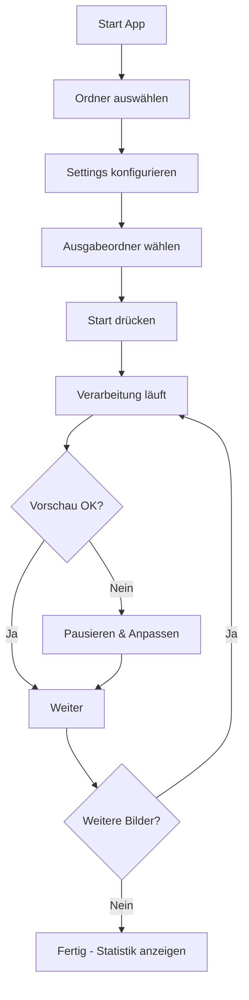

# Product Requirements Document (PRD)

## Smart Image Cropper - Automatisches Bildverarbeitungstool

**Version:** 1.0.0
**Datum:** 28. Februar 2026
**Status:** Released
**Autor:** Produktentwicklung
**Repository:** https://github.com/BassBoost1981/SmartImageCropper
**Release:** https://github.com/BassBoost1981/SmartImageCropper/releases/tag/v1.0.0

---

## 1. Executive Summary

### 1.1 Überblick
Smart Image Cropper ist eine Desktop-Anwendung für die automatisierte Batch-Verarbeitung von Bildern mit Personenerkennung. Das Tool schneidet Bilder intelligent auf Personen zu und entfernt gleichzeitig Watermarks, wobei der gesamte Prozess in Echtzeit visualisiert wird.

### 1.2 Kernfunktionalität
- **Automatische Personenerkennung** mittels KI (YOLOv8)
- **Intelligentes Cropping** mit konfigurierbarem Padding
- **Watermark-Entfernung** manuell (Zonen-basiert) + automatisch (KI-basierte Erkennung via zweites YOLO-Modell)
- **Multi-Person Handling** mit interaktivem Auswahl-Dialog (klickbare Bounding-Boxen)
- **Live-Visualisierung** des Verarbeitungsprozesses (Split-View Vorher/Nachher)
- **Batch-Verarbeitung** für hunderte Bilder mit Echtzeit-Statistiken
- **Vollständig offline** und portabel (keine Installation erforderlich)
- **Zwei Build-Varianten** — GPU (CUDA) und CPU-only

### 1.3 Zielgruppe
- Fotografen mit großen Bildbeständen
- Content Creators
- E-Commerce-Anbieter (Produktfotos)
- Social Media Manager
- Agenturen mit Bildbearbeitungsbedarf

---

## 2. Problemstellung

### 2.1 Aktueller Pain Point
Nutzer müssen große Mengen an Bildern manuell zuschneiden, wobei:
- **Zeitaufwand:** Manuelles Cropping pro Bild: 30-60 Sekunden
- **Inkonsistenz:** Unterschiedliche Crop-Qualität bei manueller Arbeit
- **Watermarks:** Müssen separat entfernt werden
- **Keine Kontrolle:** Batch-Tools ohne Vorschau = kein Quality Control
- **Cloud-Abhängigkeit:** Bestehende Tools erfordern Upload sensibler Daten

### 2.2 Warum bestehende Lösungen nicht ausreichen
| Lösung | Problem |
|--------|---------|
| Photoshop Batch | Keine KI-basierte Personenerkennung, komplex |
| Online-Tools | Datenschutz, Upload-Zeit, Kosten |
| Einfache Batch-Cropper | Kein intelligentes Cropping, keine Vorschau |
| KI-Tools (Cloud) | Teuer, Datenschutz, keine Offline-Nutzung |

---

## 3. Ziele & Nicht-Ziele

### 3.1 Ziele (In Scope)

**Phase 1 - MVP (abgeschlossen):**
- ✅ Automatische Personenerkennung mit YOLOv8n
- ✅ Batch-Verarbeitung (unbegrenzte Bildanzahl)
- ✅ Live-Vorschau während Verarbeitung (Split-View Vorher/Nachher)
- ✅ Watermark-Entfernung manuell (zonenbasiert, Slider 0-30%)
- ✅ Moderne, intuitive Glassmorphism UI (Dark Theme, Lexend Font)
- ✅ Portable EXE (keine Installation)
- ✅ GPU-Beschleunigung (CUDA) mit automatischem CPU-Fallback

**Phase 2 - Erweitert (größtenteils abgeschlossen):**
- ✅ Multi-Person Handling (interaktiver Auswahl-Dialog mit klickbaren Bounding-Boxen)
- ✅ Review-Modus (DetectionSelectionDialog bei Mehrfach-Erkennung)
- ✅ Auto-Watermark-Erkennung (zweites YOLO-Modell mit Plausibilitäts-Filtering)
- ✅ Export-Formate (JPEG, PNG, WebP — Output im Originalformat)
- ✅ Echtzeit-Statistiken (Geschwindigkeit, ETA, Erfolgsrate)
- ✅ Keyboard Shortcuts (Ctrl+O, Space, Escape, Pfeiltasten, P)
- ✅ Pause/Resume bei Multi-Detection (automatisch mit Dialog)
- ⏳ Metadaten-Erhaltung (EXIF) — Config-Key definiert, noch nicht implementiert
- ⏳ Drag & Drop für Ordner/Dateien
- ⏳ Thumbnails/Galerie-Ansicht

**Phase 3 - Advanced (offen):**
- 🔮 AI-basiertes Watermark Inpainting
- 🔮 Tooltips & Onboarding-Tutorial
- 🔮 Kontextmenüs
- 🔮 Plugins/Extensions System

### 3.2 Nicht-Ziele (Out of Scope)

❌ Video-Verarbeitung  
❌ RAW-Format Support (initial)  
❌ Erweiterte Bildbearbeitung (Filter, Effekte)  
❌ Cloud-Storage Integration  
❌ Multi-User / Team-Features  
❌ Mobile App  
❌ macOS/Linux Support (initial - nur Windows)

---

## 4. User Stories & Use Cases

### 4.1 Primary User Stories

**US-001: Batch-Verarbeitung**
```
Als Fotograf
möchte ich 500 Event-Fotos automatisch auf Personen zuschneiden
damit ich Zeit spare und konsistente Ergebnisse habe
```
**Akzeptanzkriterien:**
- Ordner-Auswahl möglich
- Verarbeitung läuft ohne Unterbrechung
- Fortschritt wird angezeigt
- Fehlerhafte Bilder werden übersprungen

**US-002: Live-Kontrolle**
```
Als E-Commerce Manager
möchte ich während der Verarbeitung sehen, wie Bilder zugeschnitten werden
damit ich Qualitätsprobleme sofort erkenne
```
**Akzeptanzkriterien:**
- Echtzeit-Vorschau jedes Bildes
- Vorher/Nachher Vergleich sichtbar
- Erkennungs-Boxen visualisiert
- Pausieren bei Problemen möglich

**US-003: Watermark-Entfernung**
```
Als Content Creator
möchte ich Stock-Fotos von Watermarks befreien
damit ich sie für Social Media nutzen kann
```
**Akzeptanzkriterien:**
- Konfigurierbare Watermark-Zone (%)
- Vorschau der Crop-Grenzen
- Watermark-Bereich wird aus Output entfernt

**US-004: Portable Nutzung**
```
Als Freelancer
möchte ich das Tool von USB-Stick starten
damit ich es an verschiedenen Arbeitsplätzen nutzen kann
```
**Akzeptanzkriterien:**
- Keine Installation erforderlich
- Alle Dependencies im Programmordner
- Settings werden lokal gespeichert
- Läuft ohne Admin-Rechte

### 4.2 Use Case Flows

**UC-001: Standard Batch Processing**



---

## 5. Funktionale Anforderungen

### 5.1 Bildverarbeitung

| ID | Anforderung | Priorität | Details |
|----|-------------|-----------|---------|
| **FR-001** | YOLO-basierte Personenerkennung | P0 | YOLOv8n für Geschwindigkeit, Confidence Threshold: 0.5 |
| **FR-002** | Multi-Person Handling | P0 ✅ | Interaktiver Auswahl-Dialog (klickbare Boxen), Auto-Regeln: all/largest/highest_conf |
| **FR-003** | Automatisches Cropping | P0 | Bounding Box + konfigurierbares Padding |
| **FR-004** | Watermark-Zonen Cropping | P0 ✅ | Manuell: Slider 0-30% (default: 0%). Auto: KI-Erkennung via zweites YOLO-Modell (best.pt) mit Plausibilitäts-Filter |
| **FR-005** | Batch-Verarbeitung | P0 | Unbegrenzte Anzahl, Multi-Threading |
| **FR-006** | Format-Support | P0 | JPEG, PNG, BMP, WebP (Input) |
| **FR-007** | Qualitäts-Einstellungen | P1 | JPEG Quality 70-100% |
| **FR-008** | Fehlerbehandlung | P0 | Skip bei Fehler, Log erstellen |

### 5.2 UI/UX Features

| ID | Feature | Priorität | Beschreibung |
|----|---------|-----------|--------------|
| **FR-101** | Split-View Vorschau | P0 ✅ | Vorher/Nachher nebeneinander mit Detection-Overlays und Bild-Navigation |
| **FR-102** | Thumbnail-Galerie | P1 ⏳ | Noch nicht implementiert — nur Prev/Next Navigation |
| **FR-103** | Detection Overlay | P1 ✅ | Farbige Bounding-Boxen auf Original (lila=Personen, rot=Watermarks) mit Legende |
| **FR-104** | Fortschrittsanzeige | P0 ✅ | Verarbeitete/Übersprungene/Fehler, Bilder/s, ETA, Elapsed Time |
| **FR-105** | Statistik-Dashboard | P1 ✅ | ProgressCard mit 6+ Metriken (in Sidebar integriert) |
| **FR-106** | Ansichts-Modi | P1 ⏳ | Nur Side-by-Side implementiert, kein Split-Slider/Overlay/Grid |
| **FR-107** | Pause/Resume | P2 ✅ | Automatische Pause bei Multi-Detection, wartet auf Benutzer-Auswahl |
| **FR-108** | Review-Modus | P2 ✅ | DetectionSelectionDialog mit klickbaren Boxen, Checkboxen und Auto-Regeln |

### 5.3 Konfiguration & Settings

| ID | Setting | Typ | Default | Range |
|----|---------|-----|---------|-------|
| **FR-201** | Watermark Prozent | Slider | 0% | 0-30% | ✅ |
| **FR-202** | Padding | Slider | 10% | 0-50% | ✅ (Prozent statt px) |
| **FR-203** | JPEG Qualität | Slider | 95 | 50-100 | ✅ |
| **FR-204** | Preview Delay | — | — | — | ❌ Nicht implementiert |
| **FR-205** | GPU Verwendung | Checkbox | true | - | ✅ |
| **FR-206** | Confidence Threshold | Slider | 0.5 | 0.1-0.9 | ✅ |
| **FR-207** | Multi-Person Modus | Dropdown | ask | ask/all/largest/highest_conf | ✅ |
| **FR-208** | Watermark Modus | Dropdown | manual | manual/auto/disabled | ✅ |
| **FR-209** | Max Workers | Slider | 4 | 1-16 | ✅ |
| **FR-210** | Output Format | Dropdown | original | original (behält Quellformat) | ✅ |

### 5.4 Datei-Management

| ID | Anforderung | Details |
|----|-------------|---------|
| **FR-301** | Ordner-Input | Rekursive Suche optional |
| **FR-302** | Multi-File Selection | Mehrfachauswahl im Dialog |
| **FR-303** | Output-Ordner | Custom oder gleicher Ordner + Suffix |
| **FR-304** | Namenskonvention | Original-Name oder Custom Pattern |
| **FR-305** | Duplikat-Handling | Überschreiben/Skip/Umbenennen |
| **FR-306** | Error-Log | CSV-Export mit Fehler-Details |

---

## 6. Technische Anforderungen

### 6.1 Technologie-Stack

**Backend/Core:**
```yaml
Sprache: Python 3.11+
KI-Framework: 
  - ultralytics (YOLOv8)
  - PyTorch 2.2+
  - CUDA 12.1+ (optional)
Bildverarbeitung:
  - OpenCV 4.9+
  - Pillow 10.2+
  - NumPy 1.26+
```

**Frontend/UI:**
```yaml
Framework: PyQt6 6.6+
Styling: Custom QSS (Glassmorphism)
Icons: Unicode Emojis + Custom SVG
```

**Build & Distribution:**
```yaml
Bundler: PyInstaller 6.0+ (Folder-Mode, kein onefile)
Kompression: 7-Zip (UPX deaktiviert — verhindert CUDA DLL-Korruption)
Target: Windows 10/11 (64-bit)
Varianten: GPU (CUDA, ~1.6 GB 7z) + CPU-only (~291 MB 7z)
Distribution: GitHub Releases
```

### 6.2 System-Anforderungen

**Minimum:**
- OS: Windows 10 64-bit
- RAM: 8 GB
- CPU: Intel i5 (8th Gen) oder AMD Ryzen 5
- GPU: Nicht erforderlich (CPU-Fallback)
- Festplatte: 2 GB frei

**Empfohlen:**
- OS: Windows 11 64-bit
- RAM: 16 GB
- CPU: Intel i7 (10th Gen+) oder AMD Ryzen 7
- GPU: NVIDIA RTX 2060+ (6GB VRAM)
- Festplatte: 5 GB frei (SSD)

**Performance-Ziele:**
- Verarbeitung: 3-5 Bilder/Sekunde (GPU)
- Verarbeitung: 1-2 Bilder/Sekunde (CPU)
- UI-Responsiveness: < 100ms für Updates
- Startup-Zeit: < 5 Sekunden
- RAM-Nutzung: < 4 GB bei 1000 Bildern

### 6.3 Architektur (Ist-Zustand)

```
┌──────────────────────────────────────────────────────┐
│                  UI Layer (PyQt6)                     │
│  MainWindow │ PreviewWidget │ DetectionSelectionDialog│
│  widgets.py │ styles.py (GLASSMORPHISM_STYLE)        │
└────────────┬─────────────────────────────────────────┘
             │ Qt Signals/Slots
┌────────────▼─────────────────────────────────────────┐
│           Threading Layer (QThread)                   │
│  ModelLoaderThread  │ ProcessingThread                │
│  PreviewLoadThread  │ (threading.Event für Pause)     │
└────────────┬─────────────────────────────────────────┘
             │
┌────────────▼─────────────────────────────────────────┐
│              AI/CV Layer                             │
│  PersonDetector (yolov8n.pt) │ CropEngine (@static)  │
│  WatermarkDetector (best.pt) │ threading.Lock()       │
└────────────┬─────────────────────────────────────────┘
             │
┌────────────▼─────────────────────────────────────────┐
│              Data Layer                              │
│  FileManager (@static) │ ConfigManager │ StatsCollector│
│  np.fromfile()+cv2.imdecode() für Unicode-Pfade      │
└──────────────────────────────────────────────────────┘
```

### 6.4 Projekt-Struktur (Ist-Zustand)

```
SmartImageCropper/
├── main.py                      # Entry Point (QApplication + ConfigManager → MainWindow)
├── src/
│   ├── ui/
│   │   ├── main_window.py       # Hauptfenster (Orchestrierung aller Threads/Signals)
│   │   ├── preview_widget.py    # Split-View Vorher/Nachher mit Detection-Overlays
│   │   ├── selection_dialog.py  # Interaktiver Multi-Detection Dialog (klickbare Boxen)
│   │   ├── widgets.py           # Wiederverwendbare UI-Komponenten (Cards, Buttons)
│   │   └── styles.py            # GLASSMORPHISM_STYLE (QSS, Dark Theme, #6c5ce7→#a855f7)
│   ├── core/
│   │   ├── processor.py         # QThread-Worker: ModelLoader, Processing, PreviewLoad
│   │   ├── detector.py          # PersonDetector (YOLOv8n, thread-locked)
│   │   ├── cropper.py           # CropEngine (@staticmethod, Padding + WM-Avoidance)
│   │   └── watermark.py         # WatermarkDetector (YOLO + Plausibilitäts-Filter)
│   └── utils/
│       ├── file_manager.py      # FileManager (@static, Unicode-sichere I/O)
│       ├── config.py            # ConfigManager (DEFAULTS + settings.json Merge)
│       ├── logger.py            # RotatingFileHandler (5MB, 3 Backups)
│       └── stats.py             # StatsCollector (Echtzeit-Metriken + ETA)
├── models/
│   ├── yolov8n.pt               # Personenerkennung (~6.5 MB)
│   └── best.pt                  # Watermark-Erkennung (~109 MB, Auto-Download von HuggingFace)
├── Font/
│   └── Lexend-VariableFont_wght.ttf  # UI-Font
├── config/
│   └── settings.json            # User Settings (runtime, nicht in Git)
├── tests/
│   ├── test_detector.py         # YOLO-Tests (skip wenn Model fehlt)
│   └── test_cropper.py          # Crop-Logik mit NumPy Arrays
├── build/
│   ├── build.spec               # PyInstaller Spec (folder mode, UPX=off)
│   ├── app.ico                  # Multi-Resolution Icon (16-256px)
│   ├── generate_icon.py         # SVG → ICO Konverter
│   └── runtime_hook_dll.py      # Torch DLL-Pfad Fix für PyInstaller
├── logo no_bg-cropped.svg       # App Logo (SVG)
├── requirements.txt
├── requirements-dev.txt
├── README.md                    # Zweisprachig (EN/DE)
└── CLAUDE.md                    # Claude Code Anweisungen
```

### 6.5 Abhängigkeiten (requirements.txt — Ist-Zustand)

```txt
# UI Framework
PyQt6>=6.6.0

# AI/ML
ultralytics>=8.1.0
torch>=2.2.0

# Bildverarbeitung
opencv-python>=4.9.0
Pillow>=10.0.0
numpy>=1.24.0

# Model Download
huggingface-hub>=0.20.0
```

**Dev-Dependencies (requirements-dev.txt):**
```txt
pytest>=7.4.0
black>=24.0.0
flake8>=7.0.0
mypy>=1.8.0
pyinstaller>=6.0.0
```

---

## 7. UI/UX Requirements

### 7.1 Design-Prinzipien

1. **Glassmorphism Modern UI**
   - Transparente Panels mit Blur-Effekt
   - Gradient-Buttons
   - Weiche Schatten & Rundungen
   - Dark Theme (Hauptfarben: #0f0f1e, #1a1a2e)

2. **Responsive Layout**
   - Minimum: 1200x800px
   - Skaliert auf 4K-Displays
   - Panels kollabierbar

3. **Feedback & Affordance**
   - Hover-Effekte auf allen Buttons
   - Loading-Indikatoren bei langen Operationen
   - Erfolgs-/Fehler-Toast-Notifications
   - Tooltips auf allen Controls

### 7.2 Farbschema (Ist-Zustand aus `styles.py`)

```css
Primary Colors:
  Background: #0f0f1e
  Card/Panel: rgba(30, 30, 55, 0.6) (Frosted Glass)
  Borders: rgba(255, 255, 255, 0.08)

Accent Colors:
  Primary Gradient: #6c5ce7 → #a855f7 (Lila)
  Success: #2ecc71
  Destructive: #e74c3c
  Stat Value: #a855f7

Text Colors:
  Primary: #e0e0e0
  Subtitle: #8888aa
  Label: #c0c0e0

Detection Overlays (selection_dialog.py):
  Person Boxes: #a855f7 (Lila, durchgezogen)
  Watermark Boxes: #e74c3c (Rot, gestrichelt)
  Selected: 100% Opacity, Unselected: 60% Alpha
```

### 7.3 Typografie (Ist-Zustand)

```css
Font Family: Lexend (Variable Font, gebundelt), Segoe UI (Fallback), sans-serif

Font geladen in main.py aus: Font/Lexend-VariableFont_wght.ttf
App-weit gesetzt via: app.setFont(QFont("Lexend", 10))
```

### 7.4 Layout-Spezifikation

**Hauptfenster (1200x800):**

```
┌──────────────────────────────────────────────────────┐
│  [HEADER: Smart Image Cropper]                       │ 80px
├─────────────┬────────────────────────────────────────┤
│             │  ┌────────────────────────────────┐    │
│   SIDEBAR   │  │   PREVIEW AREA                 │    │
│   400px     │  │   (Split-View / Gallery)       │    │ 500px
│             │  │                                │    │
│   Settings  │  └────────────────────────────────┘    │
│   Input     ├────────────────────────────────────────┤
│   Stats     │  [PROGRESS BAR]                        │ 60px
│             │  Current: image.jpg | ETA: 2:30        │
│   [START]   │  [PAUSE] [RESUME] [CANCEL]             │
└─────────────┴────────────────────────────────────────┘
                                                  ^
                                           Status Bar: 40px
```

### 7.5 Interaktions-Design

**Animation-Timing:**
- Button Hover: 150ms ease-out
- Panel Expand: 300ms ease-in-out
- Image Fade: 200ms
- Progress Update: 100ms

**Keyboard Shortcuts (implementiert):**
```
Ctrl+O       - Quellordner öffnen
Space        - Start/Stop Toggle
Escape       - Abbrechen
Left/Right   - Bild-Navigation (Vorschau)
P            - Vorschau laden
```

**Geplant aber noch nicht implementiert:**
```
Ctrl+I   - Bilder auswählen
Ctrl+S   - Settings speichern
F11      - Fullscreen Preview
Ctrl+,   - Settings Dialog
```

---

## 8. Nicht-funktionale Anforderungen

### 8.1 Performance

| Metrik | Ziel | Messung |
|--------|------|---------|
| **Startup-Zeit** | < 5s | Von EXE-Start bis UI bereit |
| **Bildverarbeitung (GPU)** | 3-5 Bilder/s | 1920x1080 JPEG |
| **Bildverarbeitung (CPU)** | 1-2 Bilder/s | 1920x1080 JPEG |
| **UI-Responsiveness** | < 100ms | Button-Click bis Feedback |
| **Preview-Update** | < 50ms | Neue Vorschau anzeigen |
| **RAM-Nutzung** | < 4GB | Bei 1000 Bildern Queue |
| **VRAM-Nutzung** | < 2GB | YOLO Model loaded |

### 8.2 Skalierbarkeit

- **Batch-Größe:** Unbegrenzt (Queue-basiert)
- **Bild-Größe:** Bis 8K (7680x4320)
- **Gleichzeitige Threads:** 4 (konfigurierbar)
- **Model-Cache:** 3 verschiedene YOLO-Modelle

### 8.3 Zuverlässigkeit

- **Fehlertoleranz:** Skip fehlerhafter Bilder, Log-Eintrag
- **Crash-Recovery:** Auto-Save von Progress alle 10 Bilder
- **Validierung:** Input-Checks vor Verarbeitung
- **Graceful Degradation:** CPU-Fallback wenn keine GPU

### 8.4 Usability

- **Lernkurve:** < 5 Minuten für Basis-Funktionen
- **Onboarding:** Tooltip-Hints beim ersten Start
- **Fehler-Messages:** Klar, actionable, in Deutsch
- **Help-System:** Integrierte F1-Hilfe

### 8.5 Wartbarkeit

- **Code-Struktur:** Modular, SOLID-Prinzipien
- **Documentation:** Docstrings für alle Public Methods
- **Logging:** Debug/Info/Warning/Error Levels
- **Unit Tests:** > 70% Code Coverage
- **Version Control:** Git mit Semantic Versioning

### 8.6 Sicherheit & Datenschutz

- **Offline-First:** Keine Internet-Verbindung erforderlich
- **Lokale Verarbeitung:** Alle Daten bleiben auf PC
- **Keine Telemetrie:** Kein Analytics/Tracking
- **EXIF-Handling:** Optional EXIF-Daten beibehalten/entfernen

---

## 9. Entwicklungs-Roadmap

### Phase 1: MVP — ABGESCHLOSSEN

- [x] Projekt-Setup & Struktur
- [x] YOLO Integration (YOLOv8n) & Testing
- [x] CropEngine (@staticmethod, Padding + WM-Avoidance)
- [x] FileManager (Unicode-sichere I/O mit np.fromfile/cv2.imdecode)
- [x] ConfigManager (DEFAULTS + JSON Merge)
- [x] PyQt6 MainWindow + Glassmorphism Dark Theme
- [x] Settings Panel (Sidebar)
- [x] File Input UI (Ordner-Dialog)
- [x] ProgressCard mit Echtzeit-Statistiken
- [x] ProcessingThread (QThread) + Batch Processing
- [x] Live Preview (Split-View Vorher/Nachher)
- [x] Error Handling + Logging (RotatingFileHandler)
- [x] GPU/CUDA Support mit automatischem CPU-Fallback
- [x] Portable EXE (PyInstaller Folder-Mode)

---

### Phase 2: Enhanced Features — GRÖßTENTEILS ABGESCHLOSSEN

- [x] Split-View Vorschau mit Detection-Overlays
- [x] Statistik in ProgressCard (Bilder/s, ETA, Erfolgsrate)
- [x] Multi-Person Handling (interaktiver Auswahl-Dialog)
- [x] Review-Modus (DetectionSelectionDialog)
- [x] Pause/Resume bei Multi-Detection
- [x] Auto-Watermark-Erkennung (zweites YOLO-Modell)
- [x] Keyboard Shortcuts (Ctrl+O, Space, Esc, Pfeiltasten, P)
- [x] Model Preloading (Background Thread)
- [ ] Thumbnail-Galerie
- [ ] EXIF/Metadaten-Erhaltung
- [ ] Drag & Drop

---

### Phase 3: Optimization & Polish — TEILWEISE ABGESCHLOSSEN

- [x] GPU-Acceleration mit CUDA + CPU-Fallback
- [x] Thread-Safety (Module-Level Locks für YOLO)
- [x] README (zweisprachig EN/DE)
- [x] GitHub Repository + Release (v1.0.0)
- [x] Zwei Build-Varianten: GPU (1.6 GB) + CPU (291 MB)
- [ ] Tooltips & Onboarding
- [ ] Kontextmenüs
- [ ] Drag & Drop
- [ ] User Manual (PDF)
- [ ] Performance-Tests (10k+ Bilder)

---

## 10. Erfolgsmetriken

### 10.1 Qualitative Metriken

| Metrik | Ziel | Messmethode |
|--------|------|-------------|
| **User Satisfaction** | > 4.5/5 | Beta-Tester Feedback |
| **Task Completion Rate** | > 95% | Erfolgreiche Batch-Runs |
| **Ease of Use** | > 4/5 | User Testing |
| **Error Rate** | < 2% | Failed Images / Total |

### 10.2 Quantitative Metriken

| Metrik | Baseline | Ziel | Messung |
|--------|----------|------|---------|
| **Time Savings** | 45s/Bild | 0.3s/Bild | Manuelle vs. Auto |
| **Processing Speed** | N/A | 3-5 Bilder/s | GPU Performance |
| **Accuracy** | N/A | > 92% | Correct Crops |
| **Startup Time** | N/A | < 5s | Launch to Ready |

### 10.3 Business Metriken

- **Downloads:** Ziel 500+ in ersten 3 Monaten
- **Active Users:** Ziel 200+ Monthly Active
- **Retention:** > 60% nach 30 Tagen
- **Support Tickets:** < 5% User Base

---

## 11. Risiken & Mitigation

### 11.1 Technische Risiken

| Risiko | Wahrscheinlichkeit | Impact | Mitigation |
|--------|-------------------|--------|------------|
| **YOLO zu langsam auf CPU** | Mittel | Hoch | CPU-optimierte Models (ONNX), Quantization |
| **PyInstaller Bundle zu groß** | Hoch | Mittel | **Gelöst:** UPX deaktiviert (CUDA-Korruption), stattdessen 7z-Kompression + CPU-only Variante (291 MB) |
| **GPU-Kompatibilität** | Mittel | Mittel | **Gelöst:** Automatischer CPU-Fallback in PersonDetector + WatermarkDetector, separate CPU-Build-Variante |
| **RAM-Overflow bei großen Batches** | Niedrig | Hoch | Queue-System, Streaming Processing |
| **False Positives bei Detection** | Mittel | Mittel | **Gelöst:** Confidence Threshold anpassbar, WatermarkDetector mit Plausibilitäts-Filter (Fläche <15%, Edge-Region), interaktiver Review-Dialog |

### 11.2 UX Risiken

| Risiko | Wahrscheinlichkeit | Impact | Mitigation |
|--------|-------------------|--------|------------|
| **UI zu komplex für Einsteiger** | Mittel | Hoch | Wizard/Tutorial beim ersten Start |
| **Preview zu langsam** | Niedrig | Mittel | Thumbnail-Caching, Progressive Loading |
| **Settings überfordern User** | Mittel | Mittel | Smart Defaults, Preset-Profiles |

### 11.3 Projekt-Risiken

| Risiko | Wahrscheinlichkeit | Impact | Mitigation |
|--------|-------------------|--------|------------|
| **Scope Creep** | Hoch | Hoch | Strikte Phase-Trennung, MVP-Focus |
| **Library Breaking Changes** | Niedrig | Mittel | Dependency Pinning, Version Lock |
| **Performance nicht erreicht** | Mittel | Hoch | Early Prototyping, Benchmarking |

---

## 12. Abhängigkeiten & Voraussetzungen

### 12.1 Externe Abhängigkeiten

- **YOLO Models:** Pre-trained Weights (Download erforderlich)
- **CUDA Toolkit:** Für GPU-Support (optional)
- **Windows SDK:** Für PyQt6 Compilation
- **Visual C++ Redistributable:** Runtime Dependency

### 12.2 Entwicklungs-Umgebung

**Required:**
- Python 3.11+ Development Environment
- Git für Version Control
- 16GB RAM Development Machine
- NVIDIA GPU für Testing (empfohlen)

**Optional:**
- PyCharm Professional / VS Code
- Figma für UI-Mockups
- Virtual Machines für Testing

### 12.3 Third-Party Licenses

| Library | License | Commercial Use |
|---------|---------|----------------|
| PyQt6 | GPL v3 / Commercial | ⚠️ Commercial License erforderlich |
| ultralytics | AGPL-3.0 | ⚠️ Enterprise License für Closed Source |
| PyTorch | BSD-3-Clause | ✅ Ja |
| OpenCV | Apache 2.0 | ✅ Ja |

**Lizenz-Strategie:**
- **Option A:** GPL Release (Open Source)
- **Option B:** PyQt Commercial License kaufen (~€500/Jahr)
- **Option C:** PySide6 als Alternative (LGPL)

---

## 13. Dokumentation & Support

### 13.1 User Documentation

**Zu erstellende Dokumente:**
1. **Quick Start Guide** (PDF, 2-4 Seiten)
2. **User Manual** (PDF, 15-20 Seiten)
3. **FAQ** (HTML/PDF)
4. **Video Tutorials** (YouTube, 3-5 Videos)
5. **Release Notes** (Markdown)

**Sprachen:**
- Deutsch (Primary)
- Englisch (Secondary)

### 13.2 Developer Documentation

1. **API Documentation** (Sphinx auto-gen)
2. **Architecture Overview** (Diagram + Beschreibung)
3. **Contribution Guidelines** (wenn Open Source)
4. **Build Instructions** (README.md)

### 13.3 Support-Kanäle

- **GitHub Issues:** Bug Reports & Feature Requests
- **Email Support:** Bei kommerzieller Version
- **Community Forum:** Optional für Open Source
- **Update-Mechanismus:** In-App Notification

---

## 14. Testing-Strategie

### 14.1 Test-Levels (Ist-Zustand)

**Unit Tests (implementiert):**
- `tests/test_cropper.py` — CropEngine Logik mit reinen NumPy Arrays (kein Model nötig)
- `tests/test_detector.py` — PersonDetector Tests (skippt automatisch wenn yolov8n.pt fehlt)
- Framework: pytest
- Coverage: noch nicht gemessen

**Noch nicht implementiert:**
- Integration Tests (End-to-End Pipeline)
- UI Tests (PyQt Test Framework)
- Performance Tests (Batch-Benchmarks)

### 14.2 Test-Datensets

- **Small Dataset:** 50 Bilder (diverse Szenarien)
- **Medium Dataset:** 500 Bilder (Performance Testing)
- **Large Dataset:** 5000+ Bilder (Stress Testing)
- **Edge Cases:** Fehlerhafte, sehr große, sehr kleine Bilder

### 14.3 Acceptance Criteria

**MVP-Akzeptanz:**
- [x] Alle P0 Requirements implementiert
- [ ] Unit Test Coverage > 70%
- [ ] Performance-Ziele erreicht (GPU: 3+ Bilder/s)
- [x] Keine Critical Bugs
- [ ] Erfolgreiche 1000-Bilder Batch ohne Crash

---

## 15. Deployment & Distribution

### 15.1 Build-Prozess (Ist-Zustand)

```bash
# 1. Dependencies installieren
pip install -r requirements.txt
pip install -r requirements-dev.txt

# 2. Tests ausführen
pytest tests/ -v

# 3. Icon generieren (nur einmal oder nach Logo-Änderung)
python build/generate_icon.py

# 4. EXE bauen (PyInstaller Folder-Mode)
build_exe.bat
# oder: pyinstaller build/build.spec --clean --noconfirm

# 5. GPU-Build mit 7-Zip packen
7z a -t7z -mx=9 SmartImageCropper-v1.0.0-win64-CUDA.7z dist/SmartImageCropper/*

# 6. CPU-Build erstellen (CUDA DLLs entfernen)
cp -r dist/SmartImageCropper dist/SmartImageCropper-CPU
# torch_cuda.dll, cu*.dll, cudnn*.dll, nv*.dll, c10_cuda.dll entfernen
7z a -t7z -mx=9 SmartImageCropper-v1.0.0-win64-CPU.7z dist/SmartImageCropper-CPU/*

# 7. GitHub Release erstellen
gh release create v1.0.0 *.7z --title "Smart Image Cropper v1.0.0"
```

**Build-Ergebnisse (v1.0.0):**
| Variante | Unkomprimiert | 7z-Archiv |
|----------|--------------|-----------|
| GPU (CUDA) | ~4.9 GB | **1.6 GB** |
| CPU-only | ~1.6 GB | **291 MB** |

### 15.2 Versioning

**Semantic Versioning:** MAJOR.MINOR.PATCH

- **MAJOR:** Breaking Changes
- **MINOR:** Neue Features (backwards compatible)
- **PATCH:** Bugfixes

**Beispiel:**
- v1.0.0 - Initial Release
- v1.1.0 - Thumbnail Gallery Feature
- v1.1.1 - Bugfix für GPU Detection

### 15.3 Distribution-Channels (Ist-Zustand)

**Gewählt: Open Source (MIT Lizenz)**
- GitHub Repository: https://github.com/BassBoost1981/SmartImageCropper
- GitHub Releases: https://github.com/BassBoost1981/SmartImageCropper/releases
- Zwei Download-Varianten: GPU (CUDA) + CPU-only

### 15.4 Update-Mechanismus

```python
class UpdateChecker:
    """Prüft auf neue Versionen"""
    def check_for_updates(self):
        # GitHub Releases API
        latest = requests.get("https://api.github.com/repos/.../releases/latest")
        if latest['tag_name'] > CURRENT_VERSION:
            show_update_dialog()
```

---

## 16. Anhang

### 16.1 Glossar

| Begriff | Definition |
|---------|------------|
| **Bounding Box** | Rechteckiger Rahmen um erkanntes Objekt |
| **Confidence Threshold** | Mindest-Wahrscheinlichkeit für Detection |
| **Crop** | Zuschneiden eines Bildausschnitts |
| **CUDA** | NVIDIA GPU-Beschleunigung |
| **EXIF** | Metadaten in Bilddateien |
| **Glassmorphism** | UI-Design mit Transparenz & Blur |
| **Inpainting** | KI-basiertes Auffüllen von Bildbereichen |
| **YOLO** | You Only Look Once - Object Detection Model |

### 16.2 Referenzen

**Technische Dokumentation:**
- [PyQt6 Documentation](https://www.riverbankcomputing.com/static/Docs/PyQt6/)
- [Ultralytics YOLO Docs](https://docs.ultralytics.com/)
- [OpenCV Tutorials](https://docs.opencv.org/4.x/d6/d00/tutorial_py_root.html)

**Design Inspiration:**
- [Glassmorphism Generator](https://hype4.academy/tools/glassmorphism-generator)
- [Dribbble - Desktop Apps](https://dribbble.com/tags/desktop-app)

### 16.3 Änderungshistorie

| Version | Datum | Autor | Änderungen |
|---------|-------|-------|------------|
| 0.1 | 2026-02-14 | Team | Initial Draft |
| 1.0 | 2026-02-14 | Team | Complete PRD |
| 1.1 | 2026-02-28 | Team | PRD aktualisiert auf Ist-Zustand nach v1.0.0 Release: Phase-Status, implementierte Features, tatsächliche Architektur, Build-Prozess (7z, GPU+CPU), Farbschema, Font, Keyboard Shortcuts, Projektstruktur, Dependencies |

---

**Nächste Schritte:**
1. ✅ PRD Review & Approval
2. ✅ Development (MVP + erweiterte Features)
3. ✅ Repository Setup (GitHub)
4. ✅ v1.0.0 Release (GPU + CPU Build)
5. ⏳ Thumbnail-Galerie implementieren
6. ⏳ EXIF/Metadaten-Erhaltung implementieren
7. ⏳ Drag & Drop für Ordner/Dateien
8. ⏳ Tooltips & Onboarding
9. ⏳ Performance-Tests mit großen Batches
10. ⏳ Test-Coverage erhöhen
